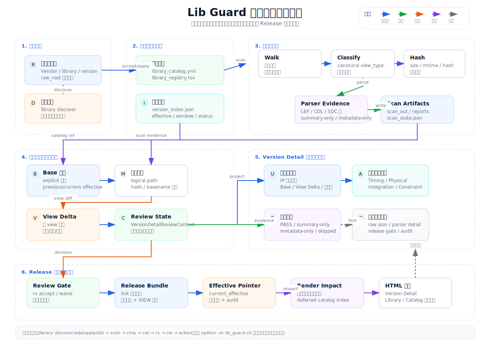

Status: current

# 架构说明

`lib_guard` 围绕审查证据组织，而不是围绕页面或命令组织。



```text
raw delivery
  -> catalog
  -> scan
  -> parser results
  -> summary/readiness
  -> diff
  -> review gate / owner override
  -> manifest-driven symlink release
```

## 源码边界

| 责任 | 路径 |
| --- | --- |
| Catalog 状态和库清单 | `src/lib_guard/catalog/` |
| Scan inventory 和 parser | `src/lib_guard/scan/` |
| Summary/readiness 构建 | `src/lib_guard/summary/` |
| 结构化对比 | `src/lib_guard/diff/` |
| Package/effective 组合 | `src/lib_guard/package/`, `src/lib_guard/effective/` |
| Release evidence 和 link/verify | `src/lib_guard/release/` |
| Review Gate 聚合 | `src/lib_guard/review/` |
| HTML 渲染 | `src/lib_guard/render/` |
| CLI 入口 | `src/lib_guard/cli.py`, `src/lib_guard/short_cli.py`, `src/lib_guard/cli_commands/` |

## Render 边界

| 页面 / 边界 | Owner |
| --- | --- |
| Catalog 渲染编排 | `src/lib_guard/render/catalog_report.py::render_catalog_html` |
| Catalog Browser / Library Workspace | `src/lib_guard/render/catalog_workspace_report.py` |
| Version Detail / update detail model | `src/lib_guard/render/version_detail_report.py` |
| Version Detail 审查上下文 | `src/lib_guard/render/version_detail_context.py` |
| 局部渲染影响模型 | `src/lib_guard/render/impact.py` |
| 共享视觉组件 | `src/lib_guard/render/product_theme.py` |

`catalog_report.py` 是 catalog render facade 和 state/task adapter，不应继续吸收
Version Detail、manual compare 或 release 逻辑。

Version Detail 是唯一审查投影。`window`、`effective`、`compare` 只是它的证据来源
和上下文，不应新增平行主审查页面。页面第一屏只回答：

- IP 使用判断。
- 当前审查对象。
- 对比上下文。
- View 变化。
- 证据 freshness。

`RenderImpact` 只负责避免投影 stale。scan、batch scan、compare、batch compare、
intake、accept-window、mark 会声明受影响的库/版本，再由 finalizer 局部刷新对应
Version Detail、库工作台和目录索引。它不负责重新发现库，也不改变 scan、diff、
release 的业务规则。

## 生成物边界

`work/` 下的 HTML 和 JSON 是审查产物，可以从源码、RAW、策略和 evidence 重新生成。
它们不是 source of truth。

Catalog HTML 会写出：

- `catalog_state.json`
- `manager_tasks.json`
- `report_index.json`

版本级 `review_gate` 会嵌入 `catalog_state.json`，也可以写到：

```text
review/<library>/<version>/review_gate.json
```

## 阻塞口径

File Diff 推荐默认只是 attention item，不等同 blocker。

常见 blocker 来源是：

- metadata-only 二进制变化需要 owner 决策。
- catalog 信任问题。
- release fatal issue。
- review gate 中未 accept/waive 的真实 blocking item。

页面和 release 逻辑不能把“算法匹配推断”直接当成事实结论；路径迁移、matched/moved
一类信息必须保留 match reason 和 confidence。
