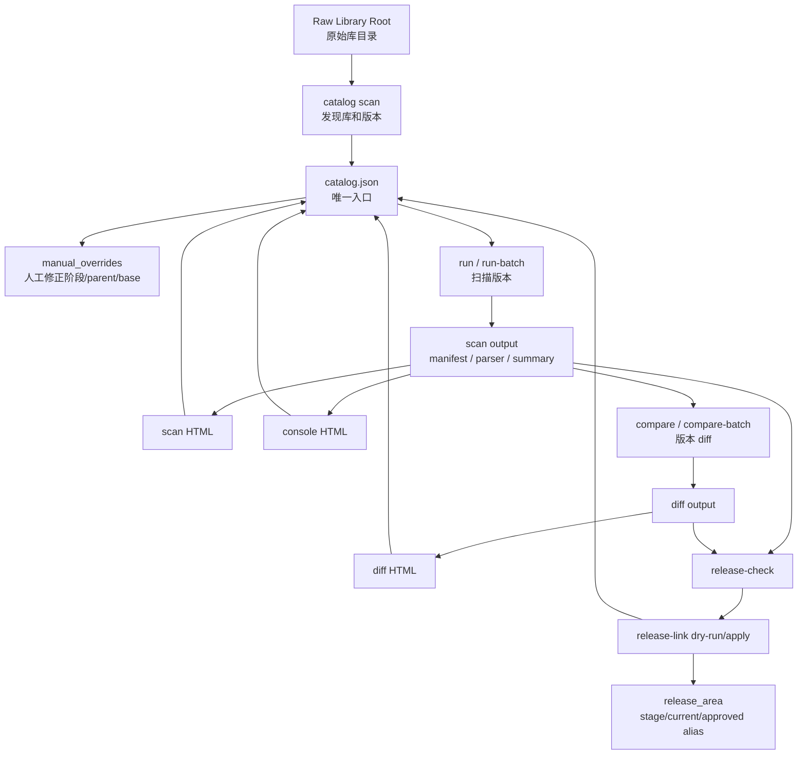

# lib_guard 当前代码架构与库管理流程说明

## v6 Review Navigation Update

Current UI and review flow:

```text
Catalog -> Diff Timeline -> Selected Diff -> recommended File Diff
```

- Catalog is the asset map and report hub. It should not directly expand full File Diff commands.
- Diff Timeline lists comparison candidates for a library.
- Selected Diff is the main comparison review page and owns the key File Diff recommendation queue.
- File Diff is a focused recommendation model, not a `done/total` completion model.
- Large or ambiguous comparisons should ask the reviewer to confirm base/comparison before generating commands.
- File Diff output should include `summary.json`, `semantic_diff.json`, `raw_text_diff.html`, and an HTML page with field changes and location hints.
- v6 pairwise types: `lef`, `liberty`, `verilog`, `cdl`, `sdc`, `upf`, `cpf`, `spef`, `db`, `waiver`, `ibis`, `pwl`, `snp`, `cpm`.

更新时间：2026-06-17  
适用版本：lib_guard v5 当前工作区代码

本文整理当前 `lib_guard` 的代码架构、库资产管理流程、核心产物、HTML 页面关系、release gate 细节，以及真实环境中建议采用的操作路径。目标不是再堆命令，而是把系统的主线收敛成一条可以被使用、排查、扩展的流程。

## 1. 当前定位

`lib_guard` 当前已经从单次脚本扫描，演进成一个面向“多库、多版本、可追踪、可审计、可发布”的库管理工具链。

它现在主要解决四件事：

1. 发现原始库目录：识别有哪些 library、有哪些 version、版本阶段是什么。
2. 扫描并解析库内容：建立文件清单、类型分类、hash、parser 结果、summary、release readiness。
3. 比较版本差异：基于两个 scan 输出做文件级、summary 级、对象级、parser 级 diff，并生成 HTML。
4. 发布准入与链接：按 release policy 检查 gate，支持 dry-run、apply、overwrite、force release。

当前建议把 `catalog.json` 作为唯一入口。也就是说，真实使用时不要每次手工拼 `--root --profile --name --version`，而是先建立 catalog，再从 catalog 触发 scan、diff、release。

## 2. 代码目录架构

当前主要源码集中在 `src/lib_guard`：

```text
src/lib_guard/
  cli.py                         # 统一命令行入口
  catalog/
    index.py                     # 原始库发现、catalog.json、catalog HTML、人工修正、runtime 状态回写
  scan/
    scanner.py                   # scan 主链路编排
    inventory.py                 # 文件遍历、分类、hash 的主实现
    file_walker.py               # 兼容转发层，导出 FileWalker
    file_classifier.py           # 兼容转发层，导出 FileClassifier
    policy.py                    # scan 阶段策略
    state.py                     # scan state snapshot / delta
    cache.py                     # parser cache
    hashing.py                   # 兼容转发层，导出 HashManager
    parser_engine.py             # parser registry、selector、executor 的主实现
    selector.py                  # 兼容转发层，导出 ParserSelector
    parser_registry.py           # 兼容转发层，导出 ParserRegistry
    parser_executor.py           # 兼容转发层，导出 ParserExecutor
    progress.py                  # JSONL 心跳和终端单行进度
    report.py                    # scan 输出落盘
    signatures.py                # signature 生成
    integrity.py                 # 完整性检查
    parsers/                     # 统一 parser 目录
  summary/
    builder.py                   # summary rebuild、dashboard/release input/readiness 重建
    readiness.py                 # release_readiness.json 构建
    builders/                    # 各类型 summary builder
  diff/
    scan_diff.py                 # scan 输出目录 diff 主入口
    file_diff.py                 # 指定文件 pairwise diff
    object_diff.py               # 对象级结构 diff
    pairwise.py                  # 生成 pairwise diff task
  release/
    config.py                    # release policy 装载
    readiness.py                 # 兼容转发层；主实现已归入 summary/readiness.py
    checker.py                   # release check gate
    linker.py                    # release link/copy/symlink/dry-run/force
    report.py                    # release markdown 辅助
  render/
    html_report.py               # scan HTML
    diff_report.py               # diff HTML
    control_console.py           # console HTML
    control_data.py              # console 数据聚合
    product_theme.py             # 共用产品化 HTML/CSS/JS 主题
  history/
    index.py                     # work/index/scan_history/index.json
  version/
    index.py                     # work/index/version_history/index.json，旧式 version graph
  update/
    updater.py                   # 增量 update file/type
  test/
    test_v5_*.py                 # 当前主流程测试
```

配置文件集中在 `configs/`：

```text
configs/
  catalog_policy.json            # catalog 目录发现规则、阶段识别规则
  release_policy.json            # required/optional views、alias gate、doc policy
  summary_policy.json            # 文件类型到 summary rebuild 的映射
```

注意：当前 parser 已统一到 `src/lib_guard/scan/parsers`，旧的 `extractors` 路径不再作为主路径使用。scan 胶水层已经收敛为 `inventory.py` 和 `parser_engine.py` 两个主实现模块，旧小模块仅作为兼容导出。

## 3. 总体架构图



## 4. Catalog 是唯一入口

### 4.1 为什么需要 catalog

真实环境里一个库可能有很多版本，例如 UCIe 可能超过 100 个版本，并且版本命名包含：

- `initial`
- `stable`
- `final`
- `ad-hoc` / `adhoc`
- 日期型版本
- 临时交付版本
- 目录结构不完全一致的版本

如果每次都手工写：

```bash
python -m lib_guard.cli scan --root "$RAW" --profile "$LIB_TYPE" --name "$LIB_NAME" --version "$LIB_VER"
```

会出现三个问题：

1. version 命名容易不一致，后续 diff 关系断掉。
2. parent/base 无法持续维护，hotfix/ad-hoc 尤其容易误判。
3. scan HTML、diff HTML、release 状态分散在不同目录，使用者不知道下一步去哪。

所以当前推荐流程是：

```text
raw root -> catalog scan -> manual override -> run/run-batch -> compare/compare-batch -> release-check/link
```

### 4.2 catalog.json 的主要结构

`catalog.json` 由 `lib_guard.catalog.index` 生成和维护，核心字段如下：

```json
{
  "schema_version": "1.0",
  "catalog_id": "catalog_YYYYMMDD_HHMMSS",
  "generated_at": "...",
  "root": "...",
  "policy_path": "...",
  "libraries": [],
  "manual_overrides": {},
  "runtime_state": {},
  "_discovered": {},
  "issues": [],
  "recommended_tasks": [],
  "summary": {}
}
```

关键分层：

- `_discovered`：自动发现结果，是系统从目录结构和文件证据推出来的原始事实。
- `manual_overrides`：人工修正层，例如 stage、parent、base、release_line、display_name、manual_review。
- `runtime_state`：运行状态层，例如 scan_dir、scan_html、diff_html、release_check/link 结果。
- `libraries[].versions[]`：由 discovered + manual_overrides + runtime_state 重建后的可展示视图。

这个分层很重要：后续重新 `catalog scan` 时，自动发现可以刷新，但人工修正和运行结果不会轻易丢失。

### 4.3 version 级字段

每个版本大致包含：

```json
{
  "version_key": "ip/ucie/stable_20250608",
  "version_id": "stable_20250608",
  "display_name": "stable_20250608",
  "stage": "stable",
  "version_type": "candidate",
  "release_line": "main",
  "raw_path": "...",
  "detected": {
    "file_count_hint": 123,
    "file_type_counts": {},
    "confidence": 0.75,
    "structure_rule": "{library}/{version}"
  },
  "lineage": {
    "parent_candidate": "stable_20250601",
    "base_candidate": "initial_20250501",
    "confidence": "HIGH",
    "source": "auto"
  },
  "scan": {
    "status": "NOT_SCANNED",
    "scan_dir": null,
    "scan_html": null,
    "console_html": null
  },
  "diff": {
    "adjacent_status": "PENDING",
    "adjacent_old_version": "stable_20250601",
    "adjacent_diff_html": null,
    "cumulative_status": "PENDING",
    "cumulative_base_version": "initial_20250501"
  },
  "release": {
    "status": "UNKNOWN",
    "check_status": null,
    "link_status": null,
    "release_dir": null,
    "alias": null
  },
  "recommended_action": "scan_then_diff",
  "manual_review": false
}
```

### 4.4 人工修正策略

catalog 允许误判后人工修正。典型修正命令：

```bash
python -m lib_guard.cli catalog override \
  --catalog "$WORK/catalog/catalog.json" \
  --version "ip/ucie/stable_20250608" \
  --stage stable \
  --parent stable_20250601 \
  --base initial_20250501 \
  --release-line main \
  --note "人工确认 parent/base"
```

常见需要人工确认的情况：

- stage 是 `unknown`。
- `ad-hoc` 版本找不到明确 parent。
- 目录名像版本，但内容不是库交付。
- 同一个库有多条 release line。
- stable/final 的先后关系不能只靠日期判断。

## 5. Scan 主链路

### 5.1 scan 阶段

`ScanRunner` 当前按 8 个阶段执行：

1. `walk`：遍历文件。
2. `classify`：识别文件类型、domain、role。
3. `hash`：计算文件 hash。
4. `parse`：选择 parser，执行解析，支持 `--parse-jobs` 并行。
5. `summary`：生成各类 summary。
6. `signatures`：生成 signature。
7. `integrity`：完整性和一致性检查。
8. `write`：落盘所有 scan 输出。

支持进度：

- `logs/scan_progress.jsonl`：持续追加事件。
- `logs/scan_progress_latest.json`：最新心跳。
- `scan-status`：查询进行中或已完成 scan 状态。
- `--console-progress`：强制终端单行进度。

### 5.2 文件分类

`scan/inventory.py` 中的 `FileClassifier` 当前识别：

- implementation：`lef`、`liberty`、`db`、`verilog`、`cdl`
- constraint：`sdc`、`upf`、`cpf`、`spef`
- documentation：`doc`、`package`、`waiver`
- layout/other：`gds`、`oas`、`ibis`、`touchstone`、`pwl`、`unknown`

文档角色会额外识别：

- `readme`
- `release_note`
- `update_note`
- `integration_guide`

### 5.3 Parser 注册

当前默认注册：

- `LefParser`
- `LibertyParser`
- `VerilogParser`
- `CdlParser`
- `SdcParser`
- `UpfParser`
- `CpfParser`
- `SpefParser`
- `DbParser`
- `FilelistParser`
- `PackageParser`
- `WaiverParser`

parser 结果既有聚合文件，也有增量文件：

- `parser_results.json`
- `parser_results/**/*.json`
- `parser_manifest.json`
- `parser_task_list.json`

这部分是 diff 和 summary rebuild 的基础数据。

### 5.4 scan 输出目录结构

一次 scan 输出目录通常包含：

```text
scan_out/
  scan_meta.json
  manifest.json
  file_inventory.json
  parser_task_list.json
  parser_manifest.json
  parser_results.json
  parser_results/
  state_delta.json
  integrity.json
  scan_issues.json
  summaries/
    lef_summary.json
    liberty_summary.json
    verilog_summary.json
    cdl_summary.json
    sdc_summary.json
    upf_summary.json
    cpf_summary.json
    spef_summary.json
    package_summary.json
    waiver_summary.json
    macro_summary.json
    port_summary.json
  summary/
    parser_quality.json
    release_readiness.json
    dashboard_summary.json
    release_input_summary.json
    summary_report.md
    summary_rebuild.json
  signatures/
    signatures.json
  logs/
    scan_progress.jsonl
    scan_progress_latest.json
    parser_errors.json
    cache_events.json
  release/
    release_check.json
    release_link.json
    release_override.json
```

其中：

- `file_inventory.json` 是文件事实清单。
- `parser_results*` 是 parser 的结构化结果。
- `summaries/*.json` 是按类型聚合后的结果。
- `summary/release_readiness.json` 是 release gate 的输入核心。
- `scan_issues.json` 是 scan 阶段发现的 warning/error/blocker。

## 6. Summary rebuild

`summary rebuild` 现在不仅重建 `dashboard_summary.json`，也会按类型重跑对应 summary builder。

例如：

```bash
python -m lib_guard.cli summary rebuild \
  --scan "$SCAN" \
  --type lef \
  --policy "$PROJ/configs/summary_policy.json"
```

根据 `configs/summary_policy.json`，`lef` 会影响：

- `lef_summary`
- `macro_summary`
- `port_summary`

重建后会覆盖对应 `summaries/*.json`，并刷新：

- `summary/dashboard_summary.json`
- `summary/release_input_summary.json`
- `summary/release_readiness.json`
- `summary/summary_report.md`

## 7. HTML 页面分工

当前有四类 HTML：

### 7.1 Catalog HTML

入口页面，面向库管理者。

职责：

- 展示发现了哪些库和版本。
- 展示 stage、scan、diff、release 状态。
- 展示待人工确认项。
- 提供 scan/diff/release 的建议命令。
- 回写并跳转 scan HTML、console HTML、diff HTML。

生成方式：

```bash
python -m lib_guard.cli catalog render \
  --catalog "$WORK/catalog/catalog.json" \
  --out "$WORK/catalog/html"
```

或者在 `catalog scan --render`、`run`、`compare`、`release-batch` 后自动刷新。

### 7.2 Scan HTML

面向单次扫描结果。

职责：

- 展示 scan meta。
- 展示文件类型统计。
- 展示 parser manifest / parser quality。
- 展示 scan issues。
- 展示 release readiness 摘要。

生成方式：

```bash
python -m lib_guard.cli render \
  --scan "$SCAN" \
  --out "$WORK/reports/ucie/stable_20250608/scan_html"
```

### 7.3 Console HTML

面向审计和准入。

职责：

- 展示 metadata / system status / statistical aggregation。
- 展示 recommended actions。
- 展示 historical trace。
- 展示 manual sign-off items。
- 聚合 config 和 review data。

生成方式：

```bash
python -m lib_guard.cli console build \
  --scan "$SCAN" \
  --out "$WORK/reports/ucie/stable_20250608/console" \
  --config-dir "$PROJ/configs"
```

### 7.4 Diff HTML

面向版本比较。

职责：

- 展示 old/new scan 差异。
- 展示新增、删除、变更、移动文件。
- 展示 summary 差异。
- 展示 component/release readiness 差异。
- 展示 pairwise diff task 和风险建议。

生成方式：

```bash
python -m lib_guard.cli diff render \
  --diff "$WORK/diff/ucie/stable_20250608/adjacent" \
  --out "$WORK/diff/ucie/stable_20250608/diff_html"
```

## 8. Diff 流程

### 8.1 diff 的输入

diff 不直接比较 raw 目录，而是比较两个 scan 输出目录。

原因：

- raw 文件太散，缺少解析结果。
- parser 结果可以支持对象级差异，例如 port、macro、module。
- summary 和 release readiness 可以判断变更是否影响准入。

### 8.2 显式 diff

```bash
python -m lib_guard.cli diff scan \
  --old "$OLD_SCAN" \
  --new "$NEW_SCAN" \
  --out "$WORK/diff/ucie/stable_20250608/explicit" \
  --diff-mode explicit
```

### 8.3 catalog 驱动 adjacent diff

```bash
python -m lib_guard.cli compare \
  --catalog "$WORK/catalog/catalog.json" \
  --library ucie \
  --new stable_20250608 \
  --mode adjacent \
  --workdir "$WORK"
```

该命令会：

1. 从 catalog 找到 `stable_20250608`。
2. 根据 `lineage.parent_candidate` 找 old version。
3. 读取 old/new 的 `scan.scan_dir`。
4. 生成 diff 输出目录。
5. 生成 diff HTML。
6. 把 `diff_dir` 和 `diff_html` 回写到 catalog。

### 8.4 catalog 驱动 cumulative diff

```bash
python -m lib_guard.cli compare \
  --catalog "$WORK/catalog/catalog.json" \
  --library ucie \
  --new stable_20250608 \
  --mode cumulative \
  --workdir "$WORK"
```

`cumulative` 会和 `lineage.base_candidate` 比较，适合看从基线到当前版本的总变化。

### 8.5 批量 diff

```bash
python -m lib_guard.cli compare-batch \
  --catalog "$WORK/catalog/catalog.json" \
  --library ucie \
  --mode adjacent \
  --only-ready \
  --workdir "$WORK"
```

`--only-ready` 会跳过没有 scan_dir 或 parent scan_dir 的版本。

## 9. Release 流程

### 9.1 release check

release check 会读取：

- `scan_meta.json`
- `file_inventory.json`
- `parser_manifest.json`
- `scan_issues.json`
- `summary/release_readiness.json`
- 可选 diff 目录
- `configs/release_policy.json`

命令：

```bash
python -m lib_guard.cli release check \
  --scan "$SCAN" \
  --policy "$PROJ/configs/release_policy.json" \
  --diff "$DIFF"
```

catalog 驱动：

```bash
python -m lib_guard.cli catalog release-check \
  --catalog "$WORK/catalog/catalog.json" \
  --library ucie \
  --version stable_20250608 \
  --policy "$PROJ/configs/release_policy.json" \
  --diff-mode adjacent
```

### 9.2 release link dry-run

默认是 dry-run，不会真正复制或链接：

```bash
python -m lib_guard.cli release link \
  --scan "$SCAN" \
  --release-root "$WORK/release_area" \
  --alias current \
  --policy "$PROJ/configs/release_policy.json" \
  --diff "$DIFF"
```

如果输出 `status=DRY_RUN`，说明只是预演。

### 9.3 真正 release

需要显式加 `--apply`：

```bash
python -m lib_guard.cli release link \
  --scan "$SCAN" \
  --release-root "$WORK/release_area" \
  --alias current \
  --policy "$PROJ/configs/release_policy.json" \
  --diff "$DIFF" \
  --apply
```

catalog 驱动：

```bash
python -m lib_guard.cli catalog release-link \
  --catalog "$WORK/catalog/catalog.json" \
  --library ucie \
  --version stable_20250608 \
  --release-root "$WORK/release_area" \
  --alias current \
  --policy "$PROJ/configs/release_policy.json" \
  --diff-mode adjacent \
  --apply
```

### 9.4 已存在目录

如果 target version 目录已经存在，需要：

```bash
--overwrite
```

否则会 BLOCKED，避免误覆盖已发布内容。

### 9.5 强制 release

如果 gate 是 `BLOCK` 或 `FAILED`，但业务上必须放行，需要同时满足：

- `--apply`
- `--force`
- `--force-reason "..."`

示例：

```bash
python -m lib_guard.cli catalog release-link \
  --catalog "$WORK/catalog/catalog.json" \
  --library ucie \
  --version stable_20250608 \
  --release-root "$WORK/release_area" \
  --alias current \
  --policy "$PROJ/configs/release_policy.json" \
  --diff-mode adjacent \
  --apply \
  --force \
  --force-reason "项目紧急验证，缺失 release note 已由邮件审计确认"
```

强制 release 会额外写：

```text
scan/release/release_override.json
```

用于审计追踪。

### 9.6 alias gate

`release_policy.json` 当前定义：

- `stage`：要求 L0，不要求 diff，允许 warning。
- `current`：要求 L1，要求 diff，允许 warning。
- `approved`：要求 L2，要求 P2 deep diff，要求人工 review 关闭，不允许 warning。

因此常见策略是：

```text
stage    -> 可用于早期内部联调
current  -> 可用于当前推荐版本，需要 adjacent diff
approved -> 可用于严格签核版本，需要深度 diff 和人工项关闭
```

## 10. 推荐真实使用流程

下面是建议的完整工作流。

### 10.1 环境变量

```bash
setenv PROJ /path/to/ai_lib
setenv RAW  /path/to/raw_libraries
setenv WORK /path/to/work
setenv PYTHONPATH "$PROJ/src"
```

### 10.2 发现库和版本

```bash
python -m lib_guard.cli catalog scan \
  --root "$RAW" \
  --out "$WORK/catalog" \
  --library-type ip \
  --policy "$PROJ/configs/catalog_policy.json" \
  --render
```

输出：

```text
$WORK/catalog/catalog.json
$WORK/catalog/libraries/*.json
$WORK/catalog/reports/catalog_summary.json
$WORK/catalog/reports/scan_candidates.json
$WORK/catalog/reports/diff_candidates.json
$WORK/catalog/html/index.html
```

### 10.3 人工确认 catalog

查看：

```bash
python -m lib_guard.cli catalog list \
  --catalog "$WORK/catalog/catalog.json" \
  --versions
```

对误判版本执行 `catalog override`。

### 10.4 扫描单个版本

```bash
python -m lib_guard.cli run \
  --catalog "$WORK/catalog/catalog.json" \
  --library ucie \
  --version stable_20250608 \
  --mode signature \
  --workdir "$WORK" \
  --config-dir "$PROJ/configs" \
  --parse-jobs 4 \
  --skip-cache \
  --console-progress \
  --progress-interval 1
```

该命令会自动完成：

```text
scan -> summary rebuild -> scan HTML -> console HTML -> catalog runtime_state 回写 -> catalog HTML 刷新
```

### 10.5 批量扫描

```bash
python -m lib_guard.cli run-batch \
  --catalog "$WORK/catalog/catalog.json" \
  --library ucie \
  --stage stable \
  --only-missing \
  --mode signature \
  --workdir "$WORK" \
  --config-dir "$PROJ/configs" \
  --parse-jobs 4 \
  --console-progress \
  --progress-interval 1
```

可以加 `--limit 5` 先小批量试跑。

### 10.6 查看 scan 状态

指定目录：

```bash
python -m lib_guard.cli scan-status \
  --scan "$SCAN"
```

或兼容写法：

```bash
python -m lib_guard.cli scan status \
  --scan "$SCAN"
```

查看 latest：

```bash
python -m lib_guard.cli scan-status \
  --latest \
  --library-id "ip/ucie/stable_20250608" \
  --mode signature \
  --workdir "$WORK"
```

### 10.7 生成 adjacent diff

```bash
python -m lib_guard.cli compare \
  --catalog "$WORK/catalog/catalog.json" \
  --library ucie \
  --new stable_20250608 \
  --mode adjacent \
  --workdir "$WORK"
```

### 10.8 批量 diff

```bash
python -m lib_guard.cli compare-batch \
  --catalog "$WORK/catalog/catalog.json" \
  --library ucie \
  --mode adjacent \
  --only-ready \
  --workdir "$WORK"
```

### 10.9 release dry-run

```bash
python -m lib_guard.cli catalog release-link \
  --catalog "$WORK/catalog/catalog.json" \
  --library ucie \
  --version stable_20250608 \
  --release-root "$WORK/release_area" \
  --alias current \
  --policy "$PROJ/configs/release_policy.json" \
  --diff-mode adjacent
```

### 10.10 release apply

```bash
python -m lib_guard.cli catalog release-link \
  --catalog "$WORK/catalog/catalog.json" \
  --library ucie \
  --version stable_20250608 \
  --release-root "$WORK/release_area" \
  --alias current \
  --policy "$PROJ/configs/release_policy.json" \
  --diff-mode adjacent \
  --apply
```

### 10.11 批量 release dry-run

```bash
python -m lib_guard.cli release-batch \
  --catalog "$WORK/catalog/catalog.json" \
  --library ucie \
  --stage stable \
  --release-root "$WORK/release_area" \
  --alias current \
  --policy "$PROJ/configs/release_policy.json" \
  --diff-mode adjacent \
  --only-ready
```

确认无误后再加 `--apply`。

## 11. 工作目录建议

建议真实环境统一为：

```text
$WORK/
  catalog/
    catalog.json
    html/
  scan_out/
    ucie/
      stable_20250601/
      stable_20250608/
  reports/
    ucie/
      stable_20250608/
        scan_html/
        console/
  diff/
    ucie/
      stable_20250608/
        adjacent/
        diff_html/
  release_area/
    ip/
      ucie/
        stable_20250608/
        current/
  index/
    parser_cache/
    scan_state/
    scan_history/
    version_history/
```

其中 catalog HTML 是主入口，其它 HTML 都应由 catalog 回写链接跳转。

## 12. 状态与索引

### 12.1 catalog runtime_state

这是当前推荐的运行状态中心：

- scan 状态
- scan HTML
- console HTML
- adjacent/cumulative diff 状态
- diff HTML
- release check/link 结果

### 12.2 scan history

`history/index.py` 维护：

```text
$WORK/index/scan_history/index.json
```

它主要服务于：

- `--latest`
- `history list`
- `history latest`

### 12.3 version history

`version/index.py` 维护：

```text
$WORK/index/version_history/index.json
```

这是更早的 version graph 入口，仍可用于：

- `version register`
- `diff adjacent`
- `diff cumulative`

但当前更推荐通过 catalog 的 `lineage` 和 `runtime_state` 管理版本关系。

## 13. 测试方案

### 13.1 基础代码验证

```bash
python -m compileall -q src/lib_guard
```

### 13.2 单元测试

```bash
python -m unittest discover -s src/lib_guard/test -p "test*.py"
```

当前已验证通过：39 个测试用例。

### 13.3 小规模真实流程测试

建议先选择 2 个版本：

```text
stable_20250601
stable_20250608
```

按顺序验证：

1. `catalog scan --render`
2. `catalog override` 修正 parent/base
3. `run` 扫描 old version
4. `run` 扫描 new version
5. `compare --mode adjacent`
6. 打开 catalog HTML，确认 Scan HTML / Console / Diff HTML 都能跳转
7. `catalog release-link` dry-run
8. 确认 gate 后再 `--apply`

### 13.4 批量前的试跑策略

对 100+ 版本不要直接全量：

```bash
python -m lib_guard.cli run-batch \
  --catalog "$WORK/catalog/catalog.json" \
  --library ucie \
  --only-missing \
  --limit 3 \
  --workdir "$WORK" \
  --parse-jobs 4
```

确认输出结构和 HTML 正常后，再扩大到：

```bash
--stage stable
```

或取消 `--limit`。

## 14. 常见问题

### 14.1 scan 只有 log，没有看到其它产物

先查：

```bash
python -m lib_guard.cli scan-status --scan "$SCAN"
```

再看：

```text
$SCAN/logs/scan_progress_latest.json
$SCAN/parser_manifest.json
$SCAN/parser_results/
$SCAN/summary/parser_quality.json
```

如果 scan 仍在 parse 阶段，大量产物可能还没写完；当前 parser 结果支持增量写盘，但最终聚合文件仍在 write 阶段统一完成。

### 14.2 release link 打印很多内容但没 release

默认是 dry-run。必须加：

```bash
--apply
```

如果输出 `BLOCKED`，需要看：

```text
$SCAN/release/release_check.json
$SCAN/release/release_link.json
```

### 14.3 current alias 被 gate 拦住

`current` 要求 L1 且需要 diff。通常需要先跑：

```bash
python -m lib_guard.cli compare --catalog "$WORK/catalog/catalog.json" --library ucie --new <version> --mode adjacent
```

然后 release 时带：

```bash
--diff-mode adjacent
```

### 14.4 approved alias 被 gate 拦住

`approved` 要求更高：

- L2
- P2 deep diff
- 无未关闭 manual review
- 不允许 warning

当前 P2 deep diff 还属于更严格的后续增强方向，所以普通版本先走 `stage/current` 更现实。

### 14.5 catalog 目录识别误判

优先处理：

1. 调整 `configs/catalog_policy.json` 的 `version_path_rules`。
2. 调整 `stage_rules`。
3. 使用 `catalog override` 修正单个版本。

不要直接手改 `libraries[].versions[]`，因为它会被 `_discovered + manual_overrides + runtime_state` 重建覆盖。

## 15. 当前不足与后续建议

当前已经打通主链路，但仍有几个实际使用中的风险点：

1. catalog policy 还需要根据真实内网目录继续增强，尤其是多 release line、多层 bundle 目录、临时目录混杂的场景。
2. `approved` 所需的 P2 deep diff 还不完整，短期不要把它作为所有版本的默认 release 目标。
3. scan 批量执行当前是串行调度多个版本，单个版本内部 parser 可并行；后续可做批量任务队列和失败续跑。
4. HTML 已经能作为入口，但真正的“操作台”还需要继续减少复制命令的成本，例如生成更明确的下一步命令和失败修复提示。
5. parser 覆盖面还需要根据真实库类型补强，例如 layout binary、复杂 Liberty/LEF/CDL 语法、压缩包内文件等。
6. release copy 模式会复制整棵库，库很大时耗时和空间压力明显；真实环境需要评估使用 `symlink` 还是 `copy`。
7. 强制 release 已支持，但必须配合审计规范，避免变成绕过 gate 的常规路径。

## 16. 当前最推荐的使用方式

日常不要从 `scan` 开始，而是从 catalog 开始：

```bash
python -m lib_guard.cli catalog scan --root "$RAW" --out "$WORK/catalog" --policy "$PROJ/configs/catalog_policy.json" --render
python -m lib_guard.cli run --catalog "$WORK/catalog/catalog.json" --library ucie --version <version> --workdir "$WORK" --parse-jobs 4 --console-progress
python -m lib_guard.cli compare --catalog "$WORK/catalog/catalog.json" --library ucie --new <version> --mode adjacent --workdir "$WORK"
python -m lib_guard.cli catalog release-link --catalog "$WORK/catalog/catalog.json" --library ucie --version <version> --release-root "$WORK/release_area" --alias current --diff-mode adjacent
```

确认 dry-run 通过后：

```bash
python -m lib_guard.cli catalog release-link --catalog "$WORK/catalog/catalog.json" --library ucie --version <version> --release-root "$WORK/release_area" --alias current --diff-mode adjacent --apply
```

这条路径最符合当前 v5 的设计：catalog 管资产，scan 管事实，diff 管变化，release 管准入，HTML 管可视化和跳转。
